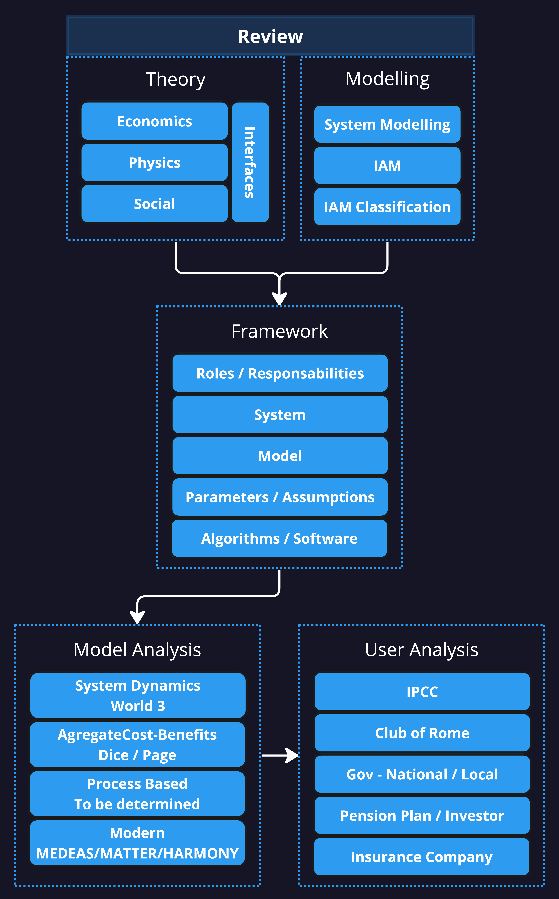

# Introduction

Humanity is currently facing its biggest chalenge. Some people belive that the problem is mostly about climate and focusing on reducing the greenhouse gas emission is the solution. Others see the temparute rise has a symptom of a bigger problem, overshooting the planet boundaries. In any case, the problem is complex and nessite a new way of thinking about society, economy, our relation with the environment and the planet. It imply a multy disciplinary approcah on the research side and a global coordination on the political side.

To help better understand those complex systems, and make appropriate decision to solve the right problem, a new type of scientific models called Integrated Assessment models (IAM) have emerge and their popularities have increase drastically in the last two decades.

"Integrated assessment models (IAMs) are simplified representations of complex physical and social systems, focusing on the interaction between economy, society and the environment."(IPCC)

"The literature on IAMs is vast and continues to grow rapidly. It is spread across many disciplines, with publications appearing in a wide range of journals, including those that focus on earth sciences, biological sciences, environmental engineering, economics, sociology, technological change, and other related fields"(IPCC).

Scientist have tried to classified them [list of papers], normally with the angle of the models specificities.

"Modelling frameworks vary vastly among themselves, and several key characteristics can be used as basis for model classification (Scrieciu et al. 2013; Dodds et al. 2015; Hardt and O’Neill 2017; Capellán-Pérez et al. 2020). Broadly, literature characterises models along three dimensions: (i) level of detail and heterogeneity, (ii) mathematical algorithm concepts, and (iii) temporal and spatial system boundaries (Krey 2014)".

While necessary for sholars and research advancement, one problem with this type of classification is it does not abstract the implmentation details and focus on the needs of the end users. Stakeholders are at risk of making decision on the basis of what is available to them instead of what are their goials and then choos e the best approach. While we could naively believe that stakeholders know what they are doing, even the biggest make us doubt it. Take for exemple the US goverment, goal 1.5, price carbon with model that was not able to pregict vcrise and dont use the 1.5....

IAM can be really complex leading to lack of transparency for non expert users as policy makers and other stakeholders. Implicit assumptions are frequent and can lead to unappropriate usage from those end users.

This book aim at providing a new framework taking the angle of the end user as the main basis for model classification. End users will be specify by their temporal and spatial system boundaries and the end goals the are reaching for. For example, a pension plan in Canada trying to securize the pension benefits of their members probably need a model different than a national goverment trying to plan the energy transitions.

We will also focus, among other characteristic, on implicit assumptions often less transparent and without getting in the normative-positive debate, try to separate what is facts vs hard science vs soft science vs values and opinions.

Finally, we also will look at how uncertainty is treated. Again, depending on the type of user and their goals, the way uncertainty is treated can make a large difference in the relevance of a model.

To make it possible, a good understanding of the different paradigm in which each type of model are rooted in is necessary. For example, World3, the model used by the authors of limits to growth, is based on the belief that we live on a finite planet while, most if not all neo-classical economic models, assumed infinite growth without firm scientific principles to justify it. While making the assumption that growth is infinite can be appropriate in certain context, in all cases it should be transparent to the users of those model.

Finally, while obvious but unfortunatly not well understood, it is important to separate the model from the asumptions. The dice model does not conclude that carbon price should be x$, the modeler decide wich assumption to use and then make a conclusion. The same model use by 2 persons with different view of the world couls arrive to very different conclusion. Which should make us ask, does the modeler the right person to decide what the society want and need?

Integrated assessments are no stronger than the underlying natural and economic science that supports them {cite}`weyant_integrated_1996`.

## Plan of the book

